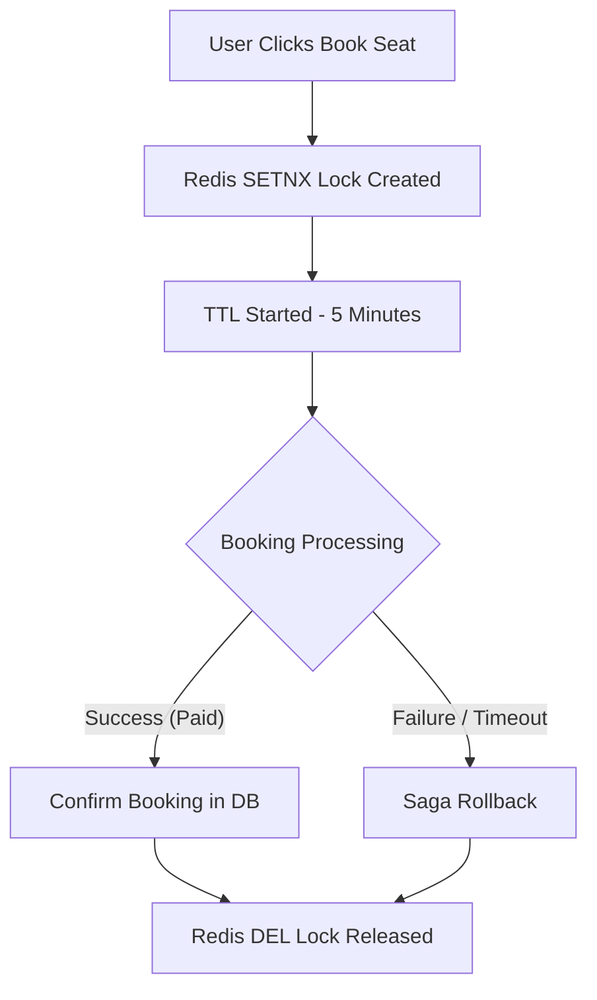

# Redis Plan Skill (FlashSeat Caching & Locking Blueprint)

When this skill is triggered or when you are working on the FlashSeat Redis integration, strictly follow the keys, commands, and workflows below.

## 1. Core Redis Operations

### Lock Seat (Distributed Lock)
*   **Key Pattern:** `lock:seat:<eventId>:<seatNumber>`
*   **Command:** `SET lock:seat:<eventId>:<seatNumber> <userId> NX PX 300000` (5-minute TTL)
*   **Purpose:** Ensures atomic seat locking. Only one user can hold the lock for a specific seat at any given time.

### Unlock Seat
*   **Key Pattern:** `lock:seat:<eventId>:<seatNumber>`
*   **Command:** `DEL lock:seat:<eventId>:<seatNumber>` (using a Lua script to ensure only the lock owner can delete it)
*   **Purpose:** Releases the seat lock when the booking is confirmed, cancelled, or when the TTL expires.

### Queue User (Traffic Control)
*   **Key Pattern:** `queue:event:<eventId>`
*   **Command:** `ZADD queue:event:<eventId> <timestamp> <userId>` (Sorted Set for FIFO ordering)
*   **Purpose:** Buffers incoming booking requests when concurrent users exceed 100,000+, serving them in order without crashing the database.

### Cache Event
*   **Key Pattern:** `cache:event:<eventId>`
*   **Command:** `SET cache:event:<eventId> <jsonString> EX 3600` (1-hour TTL)
*   **Purpose:** Bypasses MongoDB queries for highly requested event details during flash sales.

### Cache Stadium
*   **Key Pattern:** `cache:stadium:<stadiumId>`
*   **Command:** `SET cache:stadium:<stadiumId> <jsonString> EX 86400` (24-hour TTL)
*   **Purpose:** Caches stadium seating structures, since seating maps change very infrequently.

### Session Store / Token Blacklist
*   **Key Pattern:** `blacklist:token:<jwtJti>`
*   **Command:** `SET blacklist:token:<jwtJti> true EX <tokenRemainingTime>`
*   **Purpose:** Invalidates logged-out or expired JWT tokens immediately.

### Rate Limiting
*   **Key Pattern:** `rate:limit:<ipAddress>:<endpoint>`
*   **Command:** `INCR rate:limit:<ipAddress>:<endpoint>` followed by `EXPIRE`
*   **Purpose:** Prevents API abuse and botting on high-traffic routes like `/auth/login` and `/booking/lock-seat`.

---

## 2. Redis Lock & Booking Workflow

### Textual Workflow
1. **User** requests seat selection.
2. **Redis Lock Created** dynamically using a unique key (`lock:seat:<eventId>:<seatNumber>`).
3. **TTL Started** automatically (e.g., 5 minutes) to prevent deadlock if the user abandons the checkout.
4. **Booking** details are processed asynchronously via Kafka.
5. **Unlock** is triggered, deleting the lock key from Redis once the transaction finishes or fails.
