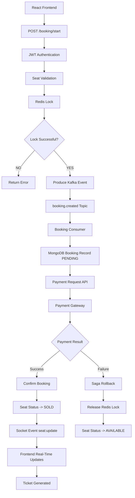

# Booking Workflow Skill (FlashSeat Process Blueprint)

When this skill is triggered or when you are working on the FlashSeat booking integration, strictly follow the process workflow outlined below.

## 1. Architectural Flowchart

---

## 2. Detailed Step-by-Step Breakdown

### Phase 1: User Request & Locking (Synchronous & Fast)
1. **React Frontend**: The user selects seat `A12` and clicks "Book Seat".
2. **POST /booking/start**: An HTTP POST request is sent to the Express backend.
3. **JWT Authentication**: Middleware validates the user's JSON Web Token to verify identity.
4. **Seat Validation**: The database is checked to ensure the seat actually exists and is not already locked or sold.
5. **Redis Lock**: The backend attempts to acquire a distributed Redis lock on the seat:
   * Key: `lock:seat:<eventId>:A12`
   * NX (Not Exists) flag guarantees only one lock succeeds.
   * TTL (5 minutes) ensures the lock expires if payment is abandoned.
6. **Lock Successful?**
   * **NO**: Return an error message to the user immediately ("Seat is currently locked by another user").
   * **YES**: The API server sends a successful "pending" response to the client and triggers the asynchronous pipeline.

### Phase 2: Message Ingestion (Asynchronous Queueing)
7. **Produce Kafka Event**: The API producer publishes an event to Kafka.
8. **booking.created**: The topic that buffers incoming bookings.
9. **Booking Consumer**: A dedicated worker consumes the creation event in the background, isolating the main Express API server from database writes.
10. **MongoDB Booking**: The worker creates a booking document in MongoDB with a state of `PENDING`.

### Phase 3: Payment & Saga Orchestration
11. **Payment Request API**: The backend communicates with the payment service.
12. **Payment Gateway**: The gateway processes the transaction (simulated or real integration).
13. **Payment Result**:
    * **Success**: 
      * **Confirm Booking**: MongoDB booking status updates to `CONFIRMED`.
      * **Seat Status -> SOLD**: MongoDB seat status updates to `SOLD`.
      * **Socket Event**: Emits a real-time `seat:update` event.
      * **Frontend Updates**: All active clients see seat `A12` turn red/unavailable instantly.
      * **Ticket Generated**: A PDF ticket/receipt is generated and sent to the user.
    * **Failure**:
      * **Saga Rollback**: Triggers compensation transactions.
      * **Release Redis Lock**: Deletes the Redis key `lock:seat:<eventId>:A12`.
      * **Seat Status -> AVAILABLE**: The seat is free again for other users to try booking.
