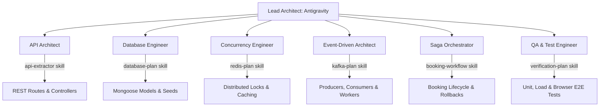

# FlashSeat - Multi-Agent Role & Verification Mapping

This document maps the specialized Agent roles loaded from our `.agents/skills/` directory to their corresponding implementation tasks and verification strategies.

---

## 1. Multi-Agent Team Breakdown

---

## 2. Agent Tasks & Verification Matrix

### 👤 1. The API Architect
*   **Skill Context:** [api-extractor](file:///.agents/skills/api-extractor/SKILL.md)
*   **Responsibility:** Design and write the REST API routes, middlewares (JWT Auth, Role restrictions), and response controllers.
*   **Tasks:**
    *   Initialize backend Express server structure.
    *   Create routes and controllers for `/auth/*`, `/booking/*`, `/events/*`, and `/stadium/*`.
*   **Verification Strategy:**
    *   Use an HTTP Client or curl to test each route.
    *   Confirm authentication headers are validated (HTTP 401 on missing JWT).
    *   Verify admin endpoints reject standard users (HTTP 403 Forbidden).

---

### 👤 2. The Database Engineer
*   **Skill Context:** [database-plan](file:///.agents/skills/database-plan/SKILL.md)
*   **Responsibility:** Define Mongoose schemas, handle data validations, establish entity relationships, and script data seeding.
*   **Tasks:**
    *   Create Mongoose models for `User`, `Stadium`, `Event`, `Seat`, and `Booking`.
    *   Build the `seed.ts` script to ingest [seed.json](file:///.agents/skills/database-plan/seed.json).
*   **Verification Strategy:**
    *   Run `npx ts-node src/scripts/seed.ts` and inspect MongoDB database collections (e.g. via Mongo Compass or shell).
    *   Assert that all stadium sections have pre-generated seats mapped to them correctly.

---

### 👤 3. The Concurrency Engineer (Redis Specialist)
*   **Skill Context:** [redis-plan](file:///.agents/skills/redis/SKILL.md)
*   **Responsibility:** Handle ultra-fast distributed locking, caching, and rate limiting to prevent double bookings.
*   **Tasks:**
    *   Implement Redis seat lock (`SETNX` with a 5-minute TTL).
    *   Configure Lua scripts for atomic lock deletion.
    *   Configure Event and Stadium response caching.
*   **Verification Strategy:**
    *   Send 100 simultaneous requests to lock the same seat.
    *   Confirm only 1 request succeeds in setting the Redis key, and 99 requests return HTTP 423/409.
    *   Check TTL using `TTL lock:seat:<eventId>:<seatNumber>` to ensure it expires in 300 seconds.

---

### 👤 4. The Event-Driven Architect (Kafka Specialist)
*   **Skill Context:** [kafka-plan](file:///.agents/skills/kafka/SKILL.md)
*   **Responsibility:** Implement asynchronous event stream handling to buffer heavy flash-sale traffic.
*   **Tasks:**
    *   Configure Kafka connection using `kafkajs`.
    *   Create the Booking Producer to publish `booking.created` events.
    *   Build Background Consumer Workers to process bookings.
*   **Verification Strategy:**
    *   Publish test events directly into the broker.
    *   Verify the Consumer logs show successful processing and database insertions.
    *   Verify partition distribution is balanced.

---

### 👤 5. The Saga Orchestrator
*   **Skill Context:** [booking-workflow](file:///.agents/skills/workflow/SKILL.md)
*   **Responsibility:** Manage multi-service transactions (locking, queueing, payment validation, seat status updates, rollback logic).
*   **Tasks:**
    *   Build Saga orchestrator workflow listener.
    *   Implement rollback logic (releasing seat, deleting Redis lock, failing booking in DB).
*   **Verification Strategy:**
    *   Trigger booking with a failed payment gateway response.
    *   Verify that:
        1. Redis lock is deleted.
        2. Seat status in DB returns to `AVAILABLE`.
        3. Booking status changes to `FAILED`.

---

### 👤 6. The QA & Test Engineer
*   **Skill Context:** [verification-plan](file:///.agents/skills/verification-plan/SKILL.md)
*   **Responsibility:** Construct integration, load, and automated E2E browser tests.
*   **Tasks:**
    *   Write E2E browser scripts to simulate booking flow.
    *   Configure load-testing suites.
*   **Verification Strategy:**
    *   Run E2E testing using the `browser_subagent` tool to verify the React frontend interacts flawlessly with the backend APIs, WebSockets, and database.
    *   Run Autocannon/Artillery to verify performance remains stable under 100,000+ simulated operations.
