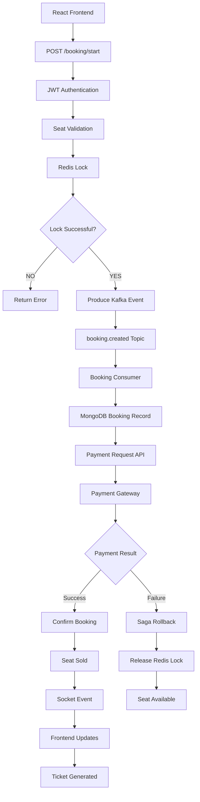

# FlashSeat - Comprehensive API Specification

This document details the complete API architecture, endpoints, and workflows for the FlashSeat system.

## 1. Authentication API
**Workflow:** `Frontend → API Gateway → Validation → Auth Controller → Auth Service → MongoDB → JWT → Frontend`
*   `POST /api/v1/auth/register`
*   `POST /api/v1/auth/login`
*   `POST /api/v1/auth/logout`
*   `POST /api/v1/auth/refresh`
*   `POST /api/v1/auth/forgot-password`
*   `POST /api/v1/auth/reset-password`
*   `POST /api/v1/auth/verify-email`
*   `GET /api/v1/auth/me`
*   `PATCH /api/v1/auth/change-password`

## 2. User API
**Workflow:** `User → JWT Middleware → Controller → Service → MongoDB`
*   `GET /users/profile`
*   `PATCH /users/profile`
*   `PATCH /users/avatar`
*   `GET /users/bookings`
*   `DELETE /users/account`

## 3. Stadium API (Admin Only)
*   `GET /stadiums`
*   `GET /stadiums/:id`
*   `POST /stadiums`
*   `PATCH /stadiums/:id`
*   `DELETE /stadiums/:id`

## 4. Event API
**Admin Workflow:** `Admin → JWT → Controller → MongoDB`
*   `GET /events`
*   `GET /events/:id`
*   `POST /events`
*   `PATCH /events/:id`
*   `DELETE /events/:id`

## 5. Seat API
**Workflow:** `User → Seat Controller → Redis → MongoDB → Socket.io`
*   `GET /events/:id/seats`
*   `GET /seat/:id`
*   `PATCH /seat/status`
*   `POST /seat/lock`
*   `DELETE /seat/unlock`

## 6. Booking API (Core Module)
**Workflow:** `User → JWT → Redis Lock → Kafka → Booking Worker → MongoDB → Socket.io`
*   `POST /booking/start`
*   `POST /booking/confirm`
*   `POST /booking/cancel`
*   `GET /booking/:id`
*   `GET /booking/history`
*   `GET /booking/status/:id`

## 7. Queue API
**Workflow:** `User → Redis Queue → Position Assigned → Socket.io`
*   `POST /queue/join`
*   `GET /queue/status`
*   `GET /queue/position`
*   `DELETE /queue/leave`

## 8. Payment API
**Workflow:** `Booking → Payment Gateway → Payment Service → MongoDB → Kafka → Saga`
*   `POST /payment/create`
*   `POST /payment/success`
*   `POST /payment/failure`
*   `POST /payment/webhook`
*   `GET /payment/status`

## 9. Ticket API
*   `GET /tickets`
*   `GET /tickets/:id`
*   `GET /tickets/download`
*   `GET /tickets/qr`

## 10. Notification API
*   `POST /notifications/send`
*   `GET /notifications`
*   `PATCH /notifications/read`

## 11. Analytics API
*   `GET /analytics/dashboard`
*   `GET /analytics/revenue`
*   `GET /analytics/bookings`
*   `GET /analytics/users`
*   `GET /analytics/live`

## 12. Admin API
*   `GET /admin/dashboard`
*   `GET /admin/users`
*   `GET /admin/bookings`
*   `PATCH /admin/booking`
*   `DELETE /admin/event`

## 13. WebSocket Events
*   `socket.connect` - Connection established
*   `seat:update` - Seat availability updates
*   `booking:progress` - Live booking progress
*   `queue:update` - Waitlist/queue position changes
*   `payment:success` - Payment confirmation
*   `notification:new` - Incoming alerts

## 14. Redis Operations
**Workflow:** `User → Redis → Lock Created → TTL Started → Booking → Unlock`
*   Lock Seat / Unlock Seat
*   Queue User
*   Cache Event & Stadium
*   Session Store & Rate Limiting

## 15. Kafka Topics
**Workflow:** `Producer → Kafka → Consumer → Worker → MongoDB`
*   `booking.created`
*   `booking.confirmed`
*   `booking.cancelled`
*   `payment.success`
*   `payment.failed`
*   `seat.locked`
*   `seat.released`
*   `notification.email`
*   `analytics.booking`
*   `analytics.payment`

## 16. Saga Workflow APIs
**Workflow:**
`Booking Created → Payment Requested`
*   **If Yes:** `Confirm Booking`
*   **If No (Rollback):** `Release Seat → Refund → Notify User`

## 17. Health APIs
*   `GET /health`
*   `GET /health/db`
*   `GET /health/redis`
*   `GET /health/kafka`
*   `GET /health/socket`

## 18. Rate Limit APIs
*   `GET /rate-limit`
*   `POST /rate-limit/reset`

## 19. Error Codes
*   Auth: `AUTH_001`, `AUTH_002`
*   Booking: `BOOKING_001`, `BOOKING_002`
*   Payment: `PAYMENT_001`, `PAYMENT_002`
*   Infrastructure: `REDIS_001`, `KAFKA_001`, `QUEUE_001`

---

## 20. Complete Booking Workflow (Architectural Flow)

