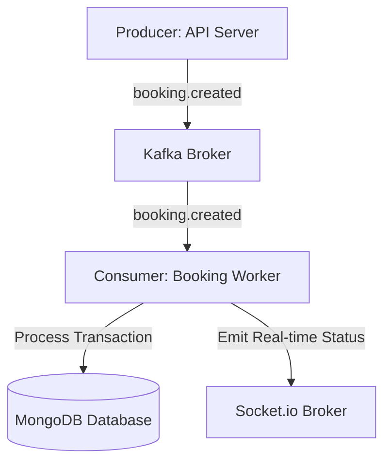

# FlashSeat - Kafka Topics & Event-Driven Architecture Plan

This document outlines the Kafka topics, producers, consumers, and message processing workflow for the FlashSeat backend.

## 1. Kafka Topics Specification

### booking.created
*   **Producer:** API Server (Booking Route `/api/v1/booking/start`)
*   **Consumer:** Booking Consumer (Worker Service)
*   **Payload:** `{ bookingId, userId, eventId, seatId, section, seatNumber, status: "PENDING" }`
*   **Purpose:** Triggers the Saga orchestrator to start the seat booking workflow.

### booking.confirmed
*   **Producer:** Saga Orchestrator (Worker Service)
*   **Consumer:** Seat Consumer, Notification Consumer, Socket Service
*   **Payload:** `{ bookingId, userId, eventId, seatId, seatNumber, status: "CONFIRMED" }`
*   **Purpose:** Finalizes the booking status in MongoDB and triggers ticket generation and client notifications.

### booking.cancelled
*   **Producer:** Saga Orchestrator (Worker Service)
*   **Consumer:** Seat Consumer, Notification Consumer, Socket Service
*   **Payload:** `{ bookingId, userId, eventId, seatId, seatNumber, reason: String }`
*   **Purpose:** Marks the booking as cancelled, triggers database rollbacks, and frees the seat.

### payment.success
*   **Producer:** Payment Service Gateway Worker
*   **Consumer:** Saga Orchestrator
*   **Payload:** `{ paymentId, bookingId, transactionId, amount, status: "SUCCESS" }`
*   **Purpose:** Notifies the Saga orchestrator that payment succeeded, allowing the transaction to proceed.

### payment.failed
*   **Producer:** Payment Service Gateway Worker
*   **Consumer:** Saga Orchestrator
*   **Payload:** `{ bookingId, errorCode, errorMessage, status: "FAILED" }`
*   **Purpose:** Notifies the Saga orchestrator that payment failed, triggering the compensation rollback transaction.

### seat.locked
*   **Producer:** Booking Service
*   **Consumer:** Socket Service, Analytics Service
*   **Payload:** `{ eventId, seatId, seatNumber, userId, expiresAt }`
*   **Purpose:** Broadcasts to all connected frontend clients that a seat has been temporarily locked.

### seat.released
*   **Producer:** Booking Service / Saga Orchestrator (Rollback)
*   **Consumer:** Socket Service, Analytics Service
*   **Payload:** `{ eventId, seatId, seatNumber }`
*   **Purpose:** Broadcasts that a seat is once again available for booking.

### notification.email
*   **Producer:** Booking Service / Payment Service
*   **Consumer:** Email / Notification Service Worker
*   **Payload:** `{ userId, email, subject, templateName, variables: {} }`
*   **Purpose:** Decouples email sending from direct user action, ensuring fast API responses.

### analytics.booking
*   **Producer:** Booking Service
*   **Consumer:** Analytics/Data Warehouse Worker
*   **Payload:** `{ eventId, seatId, section, price, timestamp }`
*   **Purpose:** Feeds real-time event analytics dashboards (e.g. seats sold per second).

### analytics.payment
*   **Producer:** Payment Service
*   **Consumer:** Analytics/Data Warehouse Worker
*   **Payload:** `{ amount, status, gateway, durationMs }`
*   **Purpose:** Tracks payment success rates, gateway performance, and revenue trends.

---

## 2. Event-Driven Workflow

### Textual Workflow
1. **Producer (API Server)** receives the request and immediately pushes a `booking.created` event to the **Kafka** queue, returning a pending response to the user.
2. **Kafka** routes the message to the corresponding partition topic.
3. **Consumer (Worker)** consumes the message asynchronously, isolating the database from direct traffic spike.
4. **Worker** updates the state in **MongoDB** and notifies the client of the updated status via WebSockets.
